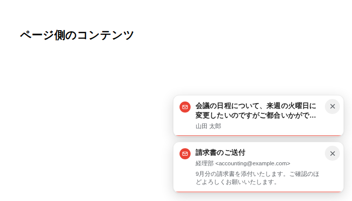
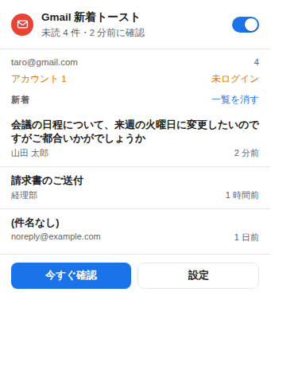
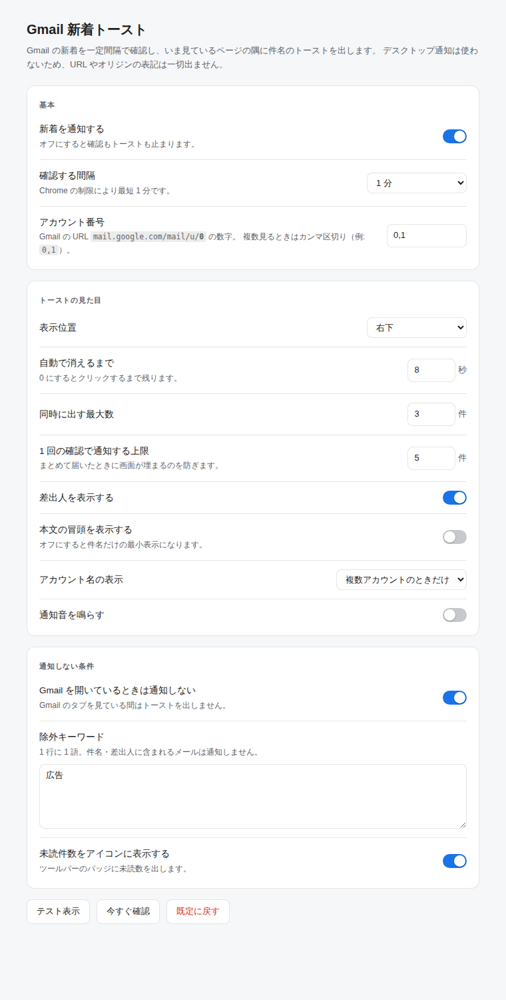

# Gmail 新着トースト

Gmail に届いた新着メールを、**いま見ているページの隅に出るコンパクトなトースト**で知らせる Chrome 拡張機能です。
件名を主役にした最小限の表示で、URL やオリジン（`mail.google.com` など）の表記は一切出ません。



## 特長

- **URL 表記なしの通知** — Chrome のデスクトップ通知を使わず、ページ内に自前のトーストを描画します。出るのは件名・差出人だけです。
- **件名がすぐ読める** — 件名を 2 行まで大きめに表示し、差出人はその下に小さく添えます。クリックするとそのメールが Gmail で開きます。
- **ページの CSS に影響されない** — Shadow DOM で描画するため、どのサイトでも同じ見た目になります。ダークモードにも追従します。
- **設定不要ですぐ動く** — ログイン済みの Cookie で Gmail の Atom フィードを読むため、Google Cloud のプロジェクト作成も OAuth の同意も要りません。
- **複数アカウント対応** — `mail.google.com/mail/u/0`、`u/1` … を同時に監視できます。

## インストール

1. このリポジトリを取得します。

   ```
   git clone https://github.com/ah24ok2-svg/chromeexpantion-kida.git
   ```

2. Chrome で `chrome://extensions` を開きます。
3. 右上の **デベロッパーモード** をオンにします。
4. **パッケージ化されていない拡張機能を読み込む** をクリックし、`manifest.json` のあるフォルダを選びます。
5. Gmail にログインした状態にしておきます。以降 1 分ごとに新着を確認します。

うまく動かないときは、拡張機能アイコンをクリックして状態（未読件数・最後に確認した時刻・ログイン状態）を確認してください。
設定画面の **テスト表示** を押すと、いまの設定でのトーストが設定画面にそのまま出ます（見た目の確認用で、Gmail へのアクセスはしません）。

## 使い方

**ツールバーのアイコン**をクリックすると、未読件数と直近の新着一覧が出ます。
件名をクリックするとそのメールが Gmail で開きます（既に Gmail のタブがあればそれを再利用します）。



**設定**（アイコン → 設定、または `chrome://extensions` の「拡張機能のオプション」）では次を変更できます。

| 項目 | 既定値 | 説明 |
| --- | --- | --- |
| 新着を通知する | オン | オフにすると確認自体を止めます |
| 確認する間隔 | 1 分 | Chrome の `chrome.alarms` の制限で最短 1 分 |
| アカウント番号 | `0` | `mail.google.com/mail/u/<N>` の N。複数はカンマ区切り |
| 表示位置 | 右下 | 四隅から選択 |
| 自動で消えるまで | 8 秒 | `0` にするとクリックするまで残る。マウスを載せている間は止まる |
| 同時に出す最大数 | 3 件 | 超えた分は古いものから消える |
| 1 回の確認で通知する上限 | 5 件 | まとめて届いたときに画面が埋まるのを防ぐ |
| 差出人 / 本文の冒頭 | オン / オフ | 件名だけの最小表示にもできる |
| アカウント名の表示 | 複数のときだけ | 常に表示 / 表示しない も選べる |
| 通知音 | オフ | 短いビープを鳴らす |
| Gmail を開いているときは通知しない | オン | Gmail のタブを見ている間はトーストを出さない |
| 除外キーワード | なし | 件名・差出人に含まれるメールを通知しない |
| 未読件数をアイコンに表示 | オン | ツールバーのバッジ |



## 仕組み

```
chrome.alarms（既定 1 分）
  └─ service worker が https://mail.google.com/mail/u/<N>/feed/atom を取得
       └─ 未読の entry を前回分と突き合わせて新着だけを抽出
            └─ アクティブなタブに toast.js を注入してトーストを表示
```

- 取得先はブラウザのログイン済み Cookie で読める **Gmail の Atom フィード**です。認証情報を拡張機能が持つことはありません。
- 通知済みのメール ID はアカウントごとに `chrome.storage.local` に保存し、同じメールを二度通知しません。
  拡張機能を入れた直後の 1 回目は、既にある未読を通知せずに記録だけします。
- MV3 の service worker には `DOMParser` が無いため、Atom の解析は `src/background/feed.js` の軽量パーサで行っています。

### ファイル構成

| パス | 役割 |
| --- | --- |
| `manifest.json` | 拡張機能の定義（Manifest V3） |
| `src/background/service_worker.js` | 定期実行・新着の差分抽出・トーストの配信・バッジ更新 |
| `src/background/feed.js` | Atom フィードの取得と解析 |
| `src/background/settings.js` | 設定の既定値と正規化 |
| `src/content/toast.js` | ページに注入されるトースト本体（Shadow DOM） |
| `src/popup/` | ツールバーアイコンのポップアップ |
| `src/options/` | 設定画面 |
| `test/` | Node のテストランナーによるテスト |

## 他の PC で使う

このリポジトリを clone して読み込むだけです。

```
git clone https://github.com/ah24ok2-svg/chromeexpantion-kida.git
```

あとは [インストール](#インストール) と同じ手順（`chrome://extensions` → デベロッパーモード → パッケージ化されていない拡張機能を読み込む）です。
更新するときは `git pull` してから `chrome://extensions` で再読み込み（🔄）します。

ただしこの方法には次の制限があります。

- Chrome を起動するたびに「デベロッパーモードの拡張機能を無効にする」という警告が出ることがあります。
- 自動更新されません。PC ごとに `git pull` と再読み込みが必要です。
- 設定は PC ごとに別々です（`chrome.storage.local` に保存しているため）。

### どの PC にも自動で入るようにしたい場合

| 方法 | 要るもの | 結果 |
| --- | --- | --- |
| **Chrome ウェブストアに限定公開（Unlisted）で出す** | 開発者登録料 $5（初回のみ）、審査 数日 | リンクを知っている人だけがインストールできる。Chrome にログインしていれば**他の PC にも自動で同期**され、更新も自動 |
| 自前でホストして企業ポリシーで配布（`ExtensionSettings`） | 各 PC の管理者権限・レジストリ / 構成プロファイルの設定 | 会社の管理 PC 向け。個人では手間が大きい |
| `.crx` ファイルを配る | — | **不可**。Chrome はウェブストア以外からの `.crx` のインストールをブロックします |

実用上は、自分の PC が数台なら clone して読み込む方法、常用するならウェブストアの限定公開がおすすめです。

## 権限について

| 権限 | 用途 |
| --- | --- |
| `alarms` | 一定間隔で新着を確認するため |
| `storage` | 設定と「通知済みメール ID」を保存するため |
| `scripting` | トーストを表示するときだけ、いま見ているタブにスクリプトを注入するため |
| `https://mail.google.com/*` | Atom フィードを取得するため |
| `http://*/*`, `https://*/*` | どのページを見ていてもトーストを出せるようにするため |

最後の 1 つのために、インストール時に「すべてのサイトのデータの読み取りと変更」という警告が出ます。
実際に注入するのは新着があったときのトースト用スクリプトだけで、ページの内容を読み取ったり外部へ送信したりはしません。
気になる場合は `chrome://extensions` の当該拡張機能の詳細から、サイトへのアクセスを「クリックされたとき」などに制限できます
（ただしトーストは表示されなくなります）。

メールの件名・差出人・本文の冒頭はローカルで処理し、外部のサーバーへは一切送信しません。

## 制限事項

- Atom フィードは **受信トレイの未読メール**だけを返します。ラベル振り分けで受信トレイをスキップしたメールは通知されません。
- 確認間隔は Chrome の制限で最短 1 分です。到着からトーストまで最大でその分の遅れがあります。
- Gmail にログインしていない、または指定したアカウント番号が使われていない場合はポップアップに警告が出ます。
- トーストは通常のウェブページにのみ表示できます。`chrome://` ページ、Chrome ウェブストア、この拡張機能の設定画面など、
  拡張機能がスクリプトを注入できないタブを見ているときは、バッジとポップアップだけが更新されます。
- Atom フィードは Google が公式にドキュメント化した API ではありません。将来仕様が変わる可能性があります。

## 開発

```
npm test        # 単体テスト（node --test）。ブラウザ不要
npm run test:e2e  # 実際の Chromium に読み込んで動かす E2E テスト
```

`npm test` は Chrome の API をモックして `service_worker.js` を実際に読み込み、初回の抑制・重複排除・除外キーワード・
件数上限・未ログイン時の扱いまでを検証します。

`npm run test:e2e` は Playwright で Chromium に拡張機能を読み込み、設定画面の「テスト表示」と、
新着があったときに見ているウェブページへトーストが出てバッジが更新されるところまでを確認します。事前に用意が必要です。

```
npm install --no-save playwright && npx playwright install chromium
```
